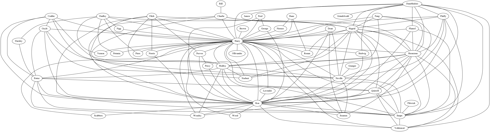

# SPLN-2020 TP1

This work assignment consists of extracting all character's name from the book "Harry Potter and the Sorcerer's Stone" and describing every interaction with each other.
The project is divided into 3 phases and as the final result, an image of the graph with all the interactions will be presented.

Name: Manuel Maria Moreno
StudentID: a67713
Date: 15/03/2020

## Pre-Processing

Before beginning the extraction, first we need to pre process the whole text by removing any noise or discardable information.

First, by using the code below, all the pages will be removed since they are not needed and cause more errors.

```python
def preprocess_remove_pages(text):
    split_by_pages = re.split(r"(Page \| [0-9]+\s.*)", text)
    return " ".join(split_by_pages[::2])
```

Also, along with stripping all trailing spaces, it is also needed to remove the trailing new spaces by using the following function

```python
def preprocess_remove_newlines(text):
    return text.replace("\n", " ")])
```

## Text Processor and Extractor

With the whole text clean, it is possible to start processing every sentence, because every time two or more characters appear in the same sentence, they will be counted as an interaction.

```python
def preprocess_into_phrases(text):
    "Split the text into a list of phrases"

    split_by_phrases = re.split(r"(\s[^A-Z][a-z]+[\.!?])", text)

    # These are the phrases
    even_elements = split_by_phrases[::2]

    # These are the end of phrases including their punctuation
    odd_elements = split_by_phrases[1::2]

    return [
        "".join([phrase, end]).strip()
        for phrase, end in zip(even_elements, odd_elements)
    ]
```

After all sentences are inserted in an array, the extraction will take place by separating each word with the first letter capitalized from each sentence.

```python
def extract_names_from_phrases(text, allowed_names):
    # Let's start by downcasing some parts
    word0, rest = text.split(" ", maxsplit=1)
    text1 = " ".join([word0.lower(), rest])

    # Now let's grab any uppercase consecutive names
    pattern = r"\b(?:[A-Z][a-z]*\b\s*)+"
    names = [name.strip() for name in re.findall(pattern, text1)]
    names = {name for name in names if name in allowed_names}

    return names

```

## WebScrapping every character

Since it is very hard for our script to understand what is a character, as part of the strategy of this project, it was decided to get a full list of every character in the book and then compare every word we got from the previous processing method.

After some research, a useful and neat website called "https://www.gradesaver.com/harry-potter-and-the-philosophers-stone/study-guide/character-list" provides with character's name along with its description.
By using "BeautifulSoup", a python library for webscrapping, it is possible to create a list with all character's name and then passing it to a file for further comparison.

loadChars.py
```python
from urllib.request import urlopen
from bs4 import BeautifulSoup

html = urlopen(
    "https://www.gradesaver.com/harry-potter-and-the-philosophers-stone/study-guide/character-list"
)
soup = BeautifulSoup(html.read(), "html.parser")
unprocessed_volume = soup.findAll("h2")
characters_array = [volume.string for volume in unprocessed_volume]
with open("characters_names.txt", "w") as out:
    for char in characters_array[1:]:
        out.write(char.string + "\n")

```

## Threshold

After getting all the interactions made by the characters in the book, many of them only appear once which can lead to an astonishing number of unnecessary pairs that, by strategy decision, will not be counted.

Removing every pair that only appears one time, the final result will be more clean and easy to read.

```python
def get_interactions_counter(names_per_phrase):
    def mkInteractions(names):
        return (tuple(sorted(comb)) for comb in itertools.combinations(names, 2))

    interactions_counter = Counter()
    for names in [names for names in names_per_phrase if len(names) > 1]:
        for pair in mkInteractions(names):
            interactions_counter[pair] += 1

    return Counter({k: v for k, v in interactions_counter.items() if v > 1})
```

## Graph

Using the python dot library for constructing graphs, we take the final result and transform it into a graph.



## Commands

This program allows the following 4 commands.

For getting every character name
```
$ python main.py names
```

Displaying every interaction
```
$ python main.py interaction
```

Display every interaction made by the given character
```
$ python main.py interactions_of <name>
```

Get the graph from all the interactions
```
$ python main.py graph > graph.dot
$ dot -Tpng graph.dot > graph.png
```